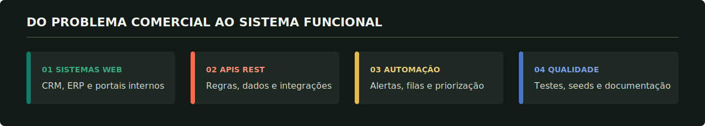
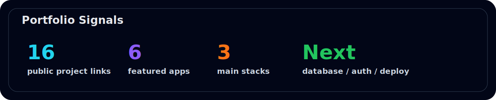
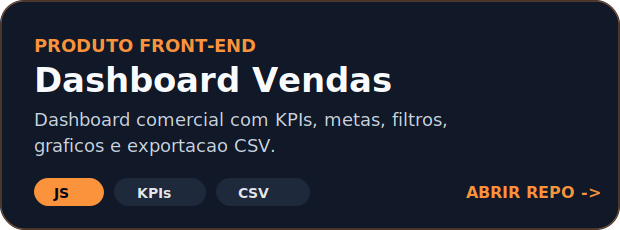
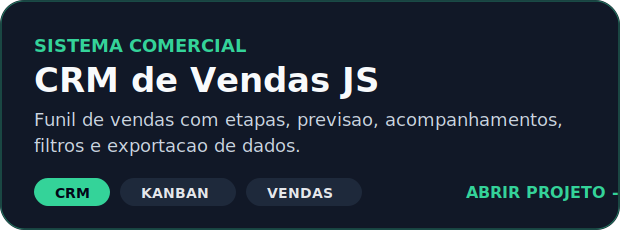
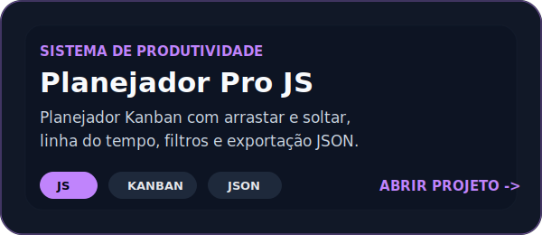
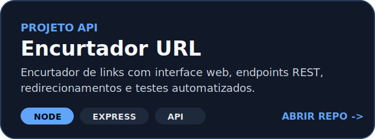
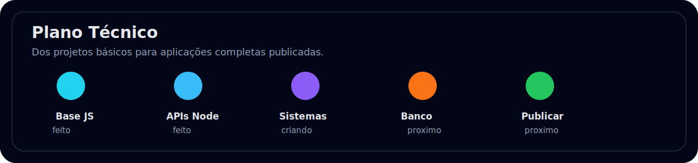

 

  

---

## :zap: Vis&atilde;o executiva

---

## :bar_chart: Sinais do portf&oacute;lio

---

## :rocket: Tecnologias

---

## :fire: Projetos principais

  <strong>Clique nos cart&otilde;es para abrir os reposit&oacute;rios.</strong>

<table width="100%">
  <tr>
    <td width="50%" align="center" valign="top">
      
    </td>
    <td width="50%" align="center" valign="top">
      
    </td>
  </tr>
  <tr>
    <td width="50%" align="center" valign="top">
      
    </td>
    <td width="50%" align="center" valign="top">
      
    </td>
  </tr>
  <tr>
    <td width="50%" align="center" valign="top">
      
    </td>
    <td width="50%" align="center" valign="top">
      
    </td>
  </tr>
</table>

---

## :compass: Mapa do portf&oacute;lio

<table>
  <tr>
    <td width="25%" valign="top">
      <h3>Sistemas completos</h3>
      
<a href="https://github.com/Kenjihidehira/erp-estoque-node">ERP Estoque Node</a>

      
<a href="https://github.com/Kenjihidehira/helpdesk-node-fullstack">Sistema de Chamados Node</a>

      
<a href="https://github.com/Kenjihidehira/encurtador-url-node">Encurtador URL Node</a>

    </td>
    <td width="25%" valign="top">
      <h3>APIs</h3>
      
<a href="https://github.com/Kenjihidehira/api-produtos-node">API Produtos Node</a>

      
<a href="https://github.com/Kenjihidehira/notas-api-node">Notas API Node</a>

    </td>
    <td width="25%" valign="top">
      <h3>Interfaces profissionais</h3>
      
<a href="https://github.com/Kenjihidehira/dashboard-vendas-pro">Painel de Vendas Pro</a>

      
<a href="https://github.com/Kenjihidehira/crm-pipeline-js">CRM Pipeline JS</a>

      
<a href="https://github.com/Kenjihidehira/planner-pro-js">Planejador Pro JS</a>

    </td>
    <td width="25%" valign="top">
      <h3>PHP e base JS</h3>
      
<a href="https://github.com/Kenjihidehira/loja-php">Loja PHP</a>

      
<a href="https://github.com/Kenjihidehira/agenda-php">Agenda PHP</a>

      
<a href="https://github.com/Kenjihidehira/lista-tarefas">Lista de tarefas</a>

    </td>
  </tr>
</table>

---

## :checkered_flag: Plano t&eacute;cnico

---

## :mag: Leitura t&eacute;cnica do portf&oacute;lio

| &Aacute;rea | O que j&aacute; aparece | Pr&oacute;ximo ajuste objetivo |
| --- | --- | --- |
| Produto | Projetos com tema real: CRM, ERP, sistema de chamados, vendas e planejador | Publicar online os melhores projetos |
| Interface | Telas com cart&otilde;es, tabelas, filtros, pain&eacute;is e fluxos | Melhorar responsividade e acessibilidade |
| Servidor e APIs | APIs REST, rotas, valida&ccedil;&otilde;es, persist&ecirc;ncia local e testes | Adicionar banco de dados real |
| Qualidade | Reposit&oacute;rios separados, READMEs e testes em projetos Node | Padronizar documenta&ccedil;&atilde;o e comandos |
| Evolu&ccedil;&atilde;o | Projetos simples, intermedi&aacute;rios e sistemas completos publicados | Criar autentica&ccedil;&atilde;o e ambiente em produ&ccedil;&atilde;o |

---

  
<strong>Todos os reposit&oacute;rios importantes</strong>

 

| Projeto | Tecnologias | Link |
| --- | --- | --- |
| ERP Estoque Node | Node.js, HTML, CSS, JS | [Abrir](https://github.com/Kenjihidehira/erp-estoque-node) |
| Sistema de Chamados Node | Node.js, HTML, CSS, JS | [Abrir](https://github.com/Kenjihidehira/helpdesk-node-fullstack) |
| Painel de Vendas Pro | HTML, CSS, JS | [Abrir](https://github.com/Kenjihidehira/dashboard-vendas-pro) |
| CRM Pipeline JS | HTML, CSS, JS | [Abrir](https://github.com/Kenjihidehira/crm-pipeline-js) |
| Planejador Pro JS | HTML, CSS, JS | [Abrir](https://github.com/Kenjihidehira/planner-pro-js) |
| Encurtador URL Node | Node.js, Express | [Abrir](https://github.com/Kenjihidehira/encurtador-url-node) |
| API Produtos Node | Node.js, Express | [Abrir](https://github.com/Kenjihidehira/api-produtos-node) |
| Notas API Node | Node.js | [Abrir](https://github.com/Kenjihidehira/notas-api-node) |
| Loja PHP | PHP, HTML, CSS | [Abrir](https://github.com/Kenjihidehira/loja-php) |
| Agenda PHP | PHP, HTML, CSS | [Abrir](https://github.com/Kenjihidehira/agenda-php) |
| Lista de tarefas | HTML, CSS, JS | [Abrir](https://github.com/Kenjihidehira/lista-tarefas) |
| Controle financeiro | HTML, CSS, JS | [Abrir](https://github.com/Kenjihidehira/controle-financeiro) |
| Kanban Board | HTML, CSS, JS | [Abrir](https://github.com/Kenjihidehira/kanban-board) |
| Pomodoro Foco | HTML, CSS, JS | [Abrir](https://github.com/Kenjihidehira/pomodoro-focus) |
| Quiz Dev JS | HTML, CSS, JS | [Abrir](https://github.com/Kenjihidehira/quiz-dev-js) |
| Cat&aacute;logo de Filmes | HTML, CSS, JS | [Abrir](https://github.com/Kenjihidehira/catalogo-filmes) |

---

