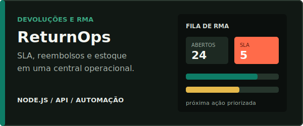
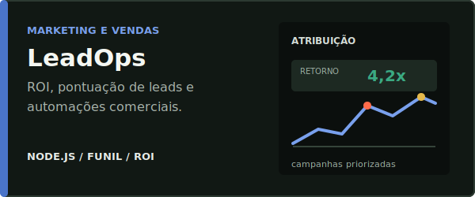
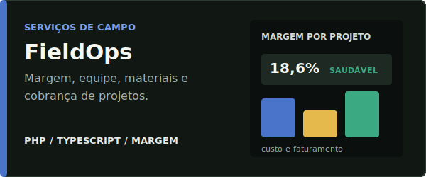

 

**Desenvolvedor web focado em sistemas comerciais, APIs, pain&eacute;is operacionais e automa&ccedil;&otilde;es.**

Transformo processos manuais em aplica&ccedil;&otilde;es claras, demonstr&aacute;veis e prontas para evoluir.

 

## O que eu entrego

Meu portf&oacute;lio &eacute; orientado a problemas comerciais reais: atendimento, vendas, cobran&ccedil;a, estoque, marketing, log&iacute;stica, agendamento e opera&ccedil;&otilde;es internas.

- **Interface utiliz&aacute;vel:** telas responsivas, filtros, tabelas, indicadores e fluxos de trabalho claros.
- **Regra de neg&oacute;cio:** valida&ccedil;&otilde;es, prioriza&ccedil;&atilde;o, c&aacute;lculos, estados e automa&ccedil;&otilde;es demonstr&aacute;veis.
- **Servidor e dados:** APIs REST, dados de demonstra&ccedil;&atilde;o, seeds e estrutura preparada para integra&ccedil;&otilde;es.
- **Entrega verific&aacute;vel:** documenta&ccedil;&atilde;o, testes, smoke tests e instru&ccedil;&otilde;es objetivas de execu&ccedil;&atilde;o.

## Projetos em destaque

  
  

  
  

  
  

| Projeto | Valor comercial | Stack principal |
| --- | --- | --- |
| [ServiceHub Agendamentos CRM](https://github.com/Kenjihidehira/servicehub-agendamentos-crm) | Agenda, clientes, funil e cobran&ccedil;as para empresas de servi&ccedil;os | Node.js, API REST, JavaScript |
| [StockPilot ERP](https://github.com/Kenjihidehira/erp-estoque-node) | Estoque, reposi&ccedil;&atilde;o, fornecedores e sugest&atilde;o de compras | Node.js, API REST, testes |
| [ResolveDesk SLA Hub](https://github.com/Kenjihidehira/helpdesk-node-fullstack) | Fila de chamados, risco de SLA e automa&ccedil;&atilde;o de suporte | Node.js, API REST, JavaScript |
| [LinkPulse](https://github.com/Kenjihidehira/encurtador-url-node) | Links de campanha, cliques, convers&atilde;o e c&oacute;digos QR | Node.js, analytics, testes |
| [CRM Pipeline JS](https://github.com/Kenjihidehira/crm-pipeline-js) | Funil comercial, previs&atilde;o, acompanhamentos e exporta&ccedil;&atilde;o | JavaScript, HTML, CSS |
| [Painel de Vendas Pro](https://github.com/Kenjihidehira/dashboard-vendas-pro) | KPIs, metas, filtros e relat&oacute;rios comerciais | JavaScript, HTML, CSS |

## Como eu trabalho

1. **Entendimento do processo:** objetivo, usu&aacute;rios, gargalos, regras e dados necess&aacute;rios.
2. **Modelagem do fluxo:** entidades, estados, automa&ccedil;&otilde;es e crit&eacute;rios de sucesso.
3. **Constru&ccedil;&atilde;o do sistema:** interface, API, integra&ccedil;&otilde;es e dados de demonstra&ccedil;&atilde;o.
4. **Valida&ccedil;&atilde;o e entrega:** testes, documenta&ccedil;&atilde;o, configura&ccedil;&atilde;o e pr&oacute;ximos passos.

## Tecnologias aplicadas

<strong>Ver projetos complementares</strong>

| Projeto | Categoria |
| --- | --- |
| [Planejador Pro JS](https://github.com/Kenjihidehira/planner-pro-js) | Kanban, capacidade e produtividade |
| [Controle Financeiro](https://github.com/Kenjihidehira/controle-financeiro) | Receitas, despesas e indicadores |
| [Loja PHP](https://github.com/Kenjihidehira/loja-php) | Cat&aacute;logo, carrinho, frete e desconto |
| [Agenda PHP](https://github.com/Kenjihidehira/agenda-php) | Agendamento responsivo |
| [API Produtos Node](https://github.com/Kenjihidehira/api-produtos-node) | API REST com Express e testes |
| [Notas API Node](https://github.com/Kenjihidehira/notas-api-node) | API REST com persist&ecirc;ncia JSON |
| [Cat&aacute;logo de Filmes](https://github.com/Kenjihidehira/catalogo-filmes) | Busca, filtros e favoritos |
| [Quiz Dev JS](https://github.com/Kenjihidehira/quiz-dev-js) | Quiz, cron&ocirc;metro e classifica&ccedil;&atilde;o |
| [Kanban Board](https://github.com/Kenjihidehira/kanban-board) | Quadro com arrastar e soltar |
| [Pomodoro Focus](https://github.com/Kenjihidehira/pomodoro-focus) | Foco e produtividade |

## Vamos conversar sobre o seu projeto

