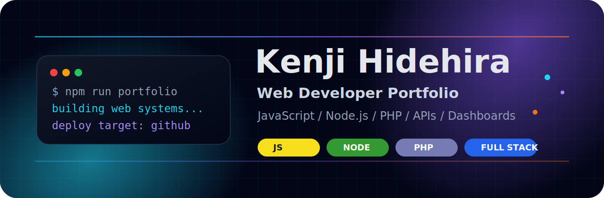
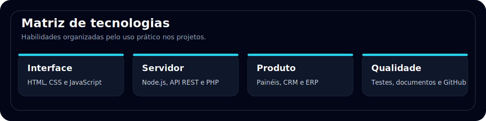
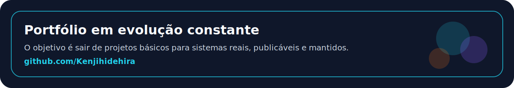

# Kenji Hidehira

**Desenvolvedor web focado em sistemas comerciais, dashboards, APIs e automa??es para neg?cios.**

  

---

## Perfil profissional

Meu GitHub ? organizado como portf?lio pr?tico para projetos freelance. A prioridade aqui n?o ? quantidade de exemplos soltos, mas sistemas que representem problemas reais de empresas: vendas, atendimento, estoque, financeiro, agendamento, compliance, log?stica, marketing e produtividade.

Trabalho com aplica??es web que precisam ter interface clara, regra de neg?cio demonstr?vel, API documentada, dados de exemplo e instru??es objetivas para rodar ou evoluir.

## O que eu construo

| ?rea | Entregas que o portf?lio demonstra |
| --- | --- |
| Sistemas web | Dashboards operacionais, CRUDs, pain?is internos, portais e fluxos de gest?o |
| APIs | Rotas REST, valida??es, seed de demonstra??o, regras de neg?cio e testes |
| Automa??o | Filas de a??o, alertas simulados, prioriza??o, scoring e processamento de dados |
| Frontend | Interfaces em portugu?s, responsivas, com tabelas, filtros, cards, KPIs e a??es claras |
| Neg?cio | Solu??es aplic?veis a atendimento, vendas, estoque, cobran?a, agenda, CRM e opera??es |

---

## Projetos comerciais em destaque

| Projeto | Problema que resolve | Stack | Reposit?rio |
| --- | --- | --- | --- |
| VendorAudit Portal de Compliance | Controle de risco, documentos, SLA e renova??es de fornecedores | Node.js, HTML, CSS, JS | [Abrir](https://github.com/Kenjihidehira/vendoraudit-compliance-portal) |
| LeadOps Atribui??o de Campanhas | Atribui??o de marketing, scoring de leads, ROI e automa??o comercial | Node.js, HTML, CSS, JS | [Abrir](https://github.com/Kenjihidehira/leadops-campaign-attribution) |
| CobreFlow Finance Ops | Cobran?a, inadimpl?ncia, prioriza??o e opera??o financeira | Node.js, HTML, CSS, JS | [Abrir](https://github.com/Kenjihidehira/cobreflow-finance-ops) |
| LogixOps Control Tower | Controle operacional de log?stica, entregas e ocorr?ncias | Node.js, HTML, CSS, JS | [Abrir](https://github.com/Kenjihidehira/logix-ops-control-tower) |
| FieldOps Margin Control | Controle de margem, equipe de campo e opera??es comerciais | TypeScript, PHP, HTML, CSS | [Abrir](https://github.com/Kenjihidehira/fieldops-margin-control) |
| ServiceHub Agendamentos CRM | Agendamento, CRM, atendimento e fila operacional | Node.js, HTML, CSS, JS | [Abrir](https://github.com/Kenjihidehira/servicehub-agendamentos-crm) |
| StockPilot ERP | Estoque, reposi??o, fornecedores, ruptura e sugest?o de compras | Node.js, HTML, CSS, JS | [Abrir](https://github.com/Kenjihidehira/erp-estoque-node) |
| ResolveDesk SLA Hub | Chamados, SLA, atendimento, prioridades e opera??o de suporte | Node.js, HTML, CSS, JS | [Abrir](https://github.com/Kenjihidehira/helpdesk-node-fullstack) |
| LinkPulse Campaign Links | Encurtador de links com m?tricas para campanhas | Node.js, HTML, CSS, JS | [Abrir](https://github.com/Kenjihidehira/encurtador-url-node) |

---

## Leitura r?pida para clientes

Se voc? est? avaliando meu perfil para um trabalho freelance, estes s?o os pontos principais:

- Consigo transformar uma necessidade comercial em um sistema naveg?vel, com telas e fluxo de uso.
- N?o entrego s? layout: os projetos incluem regras de neg?cio, APIs, dados de exemplo e valida??o local.
- Tenho foco em sistemas ?teis para pequenas e m?dias empresas: atendimento, vendas, financeiro, estoque, agenda, CRM e opera??o.
- Os reposit?rios recentes est?o com interface em portugu?s do Brasil e documenta??o objetiva.
- O pr?ximo passo natural para projetos reais ? integrar banco de dados, autentica??o, deploy e APIs externas conforme a necessidade do cliente.

---

## Tecnologias

| Camada | Tecnologias e pr?ticas |
| --- | --- |
| Frontend | HTML, CSS, JavaScript, TypeScript, UI responsiva, tabelas, formul?rios e dashboards |
| Backend | Node.js, PHP, APIs REST, valida??o de entrada e estrutura modular |
| Dados | JSON seed, persist?ncia local, prepara??o para PostgreSQL, SQLite ou integra??es externas |
| Qualidade | Smoke tests, testes de regra de neg?cio, checagem de sintaxe e README com instru??es |
| Entrega | Projetos p?blicos, documenta??o, Dockerfile quando aplic?vel e fluxo preparado para deploy |

---

## Projetos complementares

| Projeto | Tipo | Reposit?rio |
| --- | --- | --- |
| Dashboard Vendas Pro | Dashboard comercial | [Abrir](https://github.com/Kenjihidehira/dashboard-vendas-pro) |
| CRM Pipeline JS | CRM visual com funil | [Abrir](https://github.com/Kenjihidehira/crm-pipeline-js) |
| Planner Pro JS | Organiza??o de tarefas e projetos | [Abrir](https://github.com/Kenjihidehira/planner-pro-js) |
| Loja PHP | Loja simples com carrinho | [Abrir](https://github.com/Kenjihidehira/loja-php) |
| Agenda PHP | Sistema de agendamentos | [Abrir](https://github.com/Kenjihidehira/agenda-php) |
| API Produtos Node | API REST de produtos | [Abrir](https://github.com/Kenjihidehira/api-produtos-node) |
| Notas API Node | API REST de notas | [Abrir](https://github.com/Kenjihidehira/notas-api-node) |
| Controle Financeiro | App de finan?as pessoais | [Abrir](https://github.com/Kenjihidehira/controle-financeiro) |
| Kanban Board | Quadro Kanban | [Abrir](https://github.com/Kenjihidehira/kanban-board) |
| Pomodoro Focus | Produtividade e foco | [Abrir](https://github.com/Kenjihidehira/pomodoro-focus) |

---

## Como este portf?lio est? evoluindo

| Frente | Estado atual | Pr?ximo n?vel |
| --- | --- | --- |
| Produto | Projetos com contexto comercial real | Publicar previews online dos principais sistemas |
| Backend | APIs e regras de neg?cio demonstr?veis | Integrar banco relacional e autentica??o |
| Frontend | Interfaces em pt-BR, responsivas e orientadas a opera??o | Refinar acessibilidade e estados vazios/erro |
| Opera??o | Seeds, testes e documenta??o | Automatizar CI e deploy cont?nuo |

---

