

 

    

  

 <a href="https://github.com/Kenjihidehira?tab=repositories">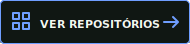</a> 

## Vis&atilde;o geral

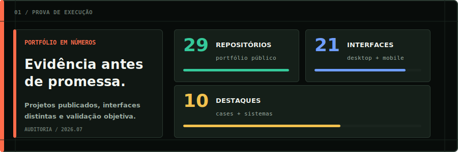

Construo **sistemas web orientados a opera&ccedil;&otilde;es reais**. Cada produto usa uma linguagem visual pr&oacute;pria, definida pelo contexto de neg&oacute;cio, sem reaproveitar o mesmo template entre aplica&ccedil;&otilde;es. O trabalho combina interface, regras de neg&oacute;cio, API, dados de demonstra&ccedil;&atilde;o e valida&ccedil;&atilde;o t&eacute;cnica para que o cliente consiga entender o fluxo antes de investir na evolu&ccedil;&atilde;o do produto.

| Foco | O que isso representa para o cliente |
| --- | --- |
| **Clareza operacional** | Indicadores, filas, prioridades e estados vis&iacute;veis em uma &uacute;nica interface |
| **Menos trabalho manual** | Automa&ccedil;&otilde;es, alertas, c&aacute;lculos e regras executados de forma consistente |
| **Decis&atilde;o baseada em dados** | KPIs, filtros, relat&oacute;rios e dados organizados por contexto comercial |
| **Base para evolu&ccedil;&atilde;o** | Estrutura pronta para autentica&ccedil;&atilde;o, banco de dados, integra&ccedil;&otilde;es e deploy |

## Estudos de caso

Quatro sistemas com **dados de exemplo, API e fluxo operacional demonstr&aacute;vel**. Os cards usam largura &uacute;nica para manter texto e indicadores leg&iacute;veis em qualquer tamanho de perfil.

  <a href="https://github.com/Kenjihidehira/returnops-rma-command-center">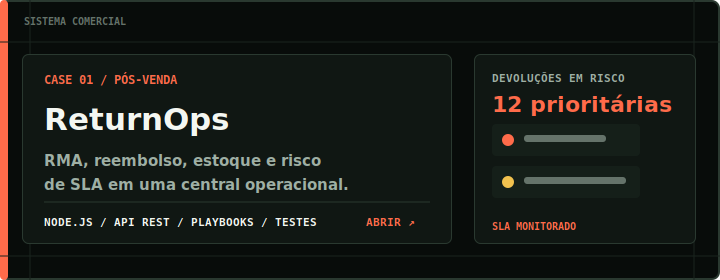</a>

 

  <a href="https://github.com/Kenjihidehira/servicehub-agendamentos-crm">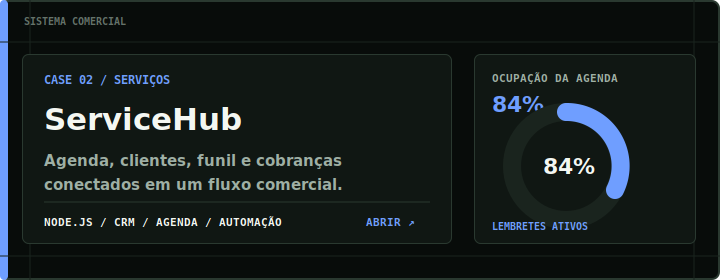</a>

 

  <a href="https://github.com/Kenjihidehira/leadops-campaign-attribution">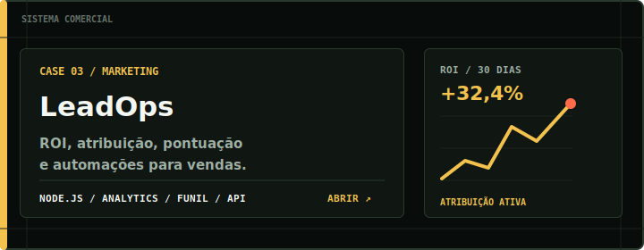</a>

 

  <a href="https://github.com/Kenjihidehira/fieldops-margin-control">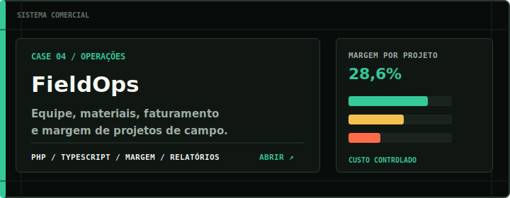</a>

### Mais sistemas comerciais

  <a href="https://github.com/Kenjihidehira/vendoraudit-compliance-portal">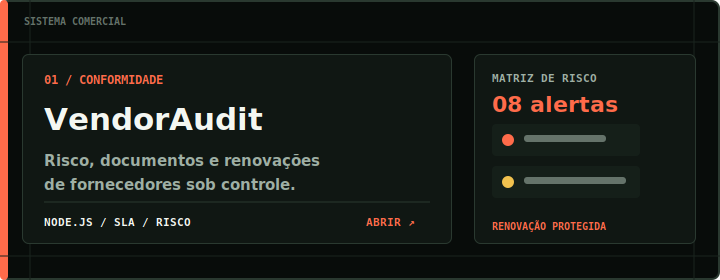</a>

  <a href="https://github.com/Kenjihidehira/cobreflow-finance-ops">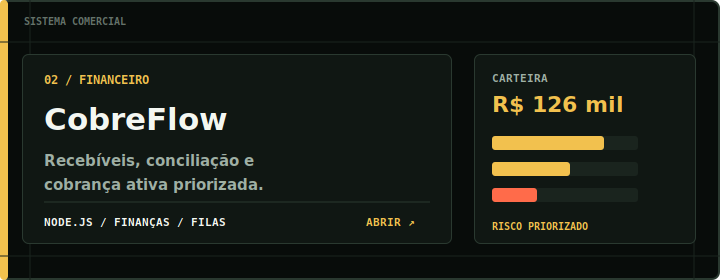</a>

  <a href="https://github.com/Kenjihidehira/logix-ops-control-tower">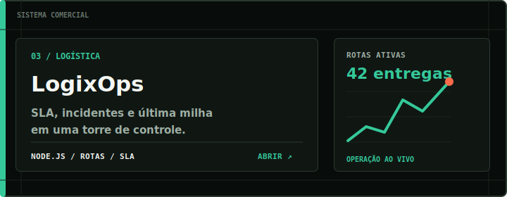</a>

  <a href="https://github.com/Kenjihidehira/erp-estoque-node">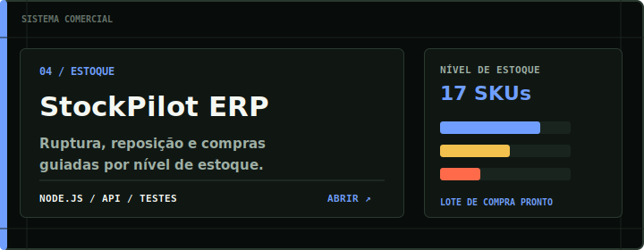</a>

  <a href="https://github.com/Kenjihidehira/helpdesk-node-fullstack">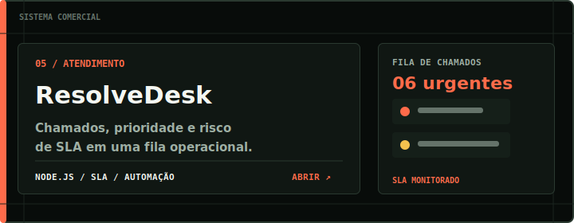</a>

  <a href="https://github.com/Kenjihidehira/encurtador-url-node">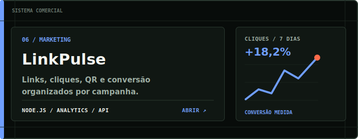</a>

## Engenharia e qualidade

- Regras de neg&oacute;cio separadas da camada de interface para facilitar testes e evolu&ccedil;&atilde;o.
- APIs com valida&ccedil;&atilde;o de entrada, respostas previs&iacute;veis e dados de demonstra&ccedil;&atilde;o reproduz&iacute;veis.
- Testes unit&aacute;rios, smoke tests HTTP e checagens est&aacute;ticas proporcionais ao risco de cada projeto.
- READMEs com instala&ccedil;&atilde;o, endpoints, arquitetura, dados de exemplo e op&ccedil;&otilde;es de deploy.

## Processo de trabalho

1. **Entender:** processo atual, usu&aacute;rios, gargalos, regras e resultado esperado.
2. **Modelar:** entidades, estados, permiss&otilde;es, automa&ccedil;&otilde;es e crit&eacute;rios de sucesso.
3. **Construir:** interface, API, persist&ecirc;ncia e integra&ccedil;&otilde;es necess&aacute;rias.
4. **Validar:** cen&aacute;rios cr&iacute;ticos, testes, documenta&ccedil;&atilde;o e entrega demonstr&aacute;vel.

## Stack aplicada

<strong>Explorar outros projetos do portf&oacute;lio</strong>

| Projeto | Categoria | Principal demonstra&ccedil;&atilde;o |
| --- | --- | --- |
| [CRM Pipeline JS](https://github.com/Kenjihidehira/crm-pipeline-js) | Vendas | Funil, previs&atilde;o e acompanhamentos |
| [Painel de Vendas Pro](https://github.com/Kenjihidehira/dashboard-vendas-pro) | Comercial | KPIs, metas, filtros e exporta&ccedil;&atilde;o |
| [Planejador Pro JS](https://github.com/Kenjihidehira/planner-pro-js) | Produtividade | Kanban, capacidade e linha do tempo |
| [Controle Financeiro](https://github.com/Kenjihidehira/controle-financeiro) | Financeiro | Receitas, despesas e indicadores |
| [Loja PHP](https://github.com/Kenjihidehira/loja-php) | Com&eacute;rcio | Cat&aacute;logo, carrinho, frete e desconto |
| [Agenda PHP](https://github.com/Kenjihidehira/agenda-php) | Agendamento | Fluxo responsivo de reservas |
| [API Produtos Node](https://github.com/Kenjihidehira/api-produtos-node) | Backend | API REST com Express e testes |
| [Notas API Node](https://github.com/Kenjihidehira/notas-api-node) | Backend | Persist&ecirc;ncia JSON e testes nativos |
| [Cat&aacute;logo de Filmes](https://github.com/Kenjihidehira/catalogo-filmes) | Interface | Busca, filtros e favoritos |
| [Kanban Board](https://github.com/Kenjihidehira/kanban-board) | Produtividade | Arrastar e soltar e armazenamento local |

## Vamos conversar sobre o seu projeto

  

