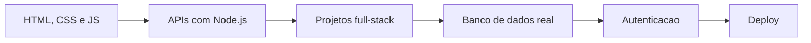

<div align="center">


<br>

<a href="https://github.com/Kenjihidehira">
  
</a>


<br><br>


</div>

---

## :zap: Visao geral

<table>
  <tr>
    <td width="60%" valign="top">

```txt
Desenvolvedor em evolucao focado em projetos praticos.

Stack atual:
- Front-end: HTML, CSS, JavaScript
- Back-end : Node.js, APIs REST, PHP
- Produto  : Dashboards, CRM, ERP, Helpdesk, Kanban e CRUDs

Objetivo:
Construir portfolio publico com projetos reais, organizados e evolutivos.
```

  </td>
    <td width="40%" valign="top">

### Agora

- Construindo projetos full-stack
- Melhorando organizacao de codigo
- Criando APIs e dashboards
- Evoluindo para banco de dados real
- Preparando projetos para deploy

  </td>
  </tr>
</table>

---

## :rocket: Projetos em destaque

<table>
  <tr>
    <td width="50%" valign="top">
      <h3>ERP Estoque Node</h3>
      <p>Mini ERP full-stack com API REST, produtos, movimenta&ccedil;&otilde;es, estoque, dashboard e testes.</p>
      <p>
        <code>Node.js</code>
        <code>API REST</code>
        <code>Dashboard</code>
        <code>Testes</code>
      </p>
      <a href="https://github.com/Kenjihidehira/erp-estoque-node"><strong>Abrir repositorio</strong></a>
    </td>
    <td width="50%" valign="top">
      <h3>Helpdesk Node Fullstack</h3>
      <p>Sistema de chamados com painel, API propria, fluxo de atendimento e testes automatizados.</p>
      <p>
        <code>Node.js</code>
        <code>Full-stack</code>
        <code>Chamados</code>
        <code>Testes</code>
      </p>
      <a href="https://github.com/Kenjihidehira/helpdesk-node-fullstack"><strong>Abrir repositorio</strong></a>
    </td>
  </tr>
  <tr>
    <td width="50%" valign="top">
      <h3>Dashboard Vendas Pro</h3>
      <p>Dashboard comercial com KPIs, metas, filtros, graficos e exportacao CSV.</p>
      <p>
        <code>HTML</code>
        <code>CSS</code>
        <code>JavaScript</code>
        <code>CSV</code>
      </p>
      <a href="https://github.com/Kenjihidehira/dashboard-vendas-pro"><strong>Abrir repositorio</strong></a>
    </td>
    <td width="50%" valign="top">
      <h3>CRM Pipeline JS</h3>
      <p>CRM visual com pipeline de vendas, forecast, follow-ups, filtros e exportacao de dados.</p>
      <p>
        <code>JavaScript</code>
        <code>CRM</code>
        <code>Pipeline</code>
        <code>Forecast</code>
      </p>
      <a href="https://github.com/Kenjihidehira/crm-pipeline-js"><strong>Abrir repositorio</strong></a>
    </td>
  </tr>
  <tr>
    <td width="50%" valign="top">
      <h3>Planner Pro JS</h3>
      <p>Planner com Kanban drag and drop, timeline, capacidade, filtros e exportacao JSON.</p>
      <p>
        <code>HTML</code>
        <code>CSS</code>
        <code>JavaScript</code>
        <code>LocalStorage</code>
      </p>
      <a href="https://github.com/Kenjihidehira/planner-pro-js"><strong>Abrir repositorio</strong></a>
    </td>
    <td width="50%" valign="top">
      <h3>Encurtador URL Node</h3>
      <p>Encurtador de links com interface web, API, redirecionamento e testes.</p>
      <p>
        <code>Node.js</code>
        <code>Express</code>
        <code>API</code>
        <code>Testes</code>
      </p>
      <a href="https://github.com/Kenjihidehira/encurtador-url-node"><strong>Abrir repositorio</strong></a>
    </td>
  </tr>
</table>

---

## :compass: Mapa do portfolio

| Categoria | Repositorios |
| --- | --- |
| Full-stack Node.js | [ERP Estoque Node](https://github.com/Kenjihidehira/erp-estoque-node) / [Helpdesk Node Fullstack](https://github.com/Kenjihidehira/helpdesk-node-fullstack) / [Encurtador URL Node](https://github.com/Kenjihidehira/encurtador-url-node) |
| APIs Node.js | [API Produtos Node](https://github.com/Kenjihidehira/api-produtos-node) / [Notas API Node](https://github.com/Kenjihidehira/notas-api-node) |
| Front-end avancado | [Dashboard Vendas Pro](https://github.com/Kenjihidehira/dashboard-vendas-pro) / [CRM Pipeline JS](https://github.com/Kenjihidehira/crm-pipeline-js) / [Planner Pro JS](https://github.com/Kenjihidehira/planner-pro-js) |
| PHP | [Loja PHP](https://github.com/Kenjihidehira/loja-php) / [Agenda PHP](https://github.com/Kenjihidehira/agenda-php) |
| Base JavaScript | [Lista de tarefas](https://github.com/Kenjihidehira/lista-tarefas) / [Controle financeiro](https://github.com/Kenjihidehira/controle-financeiro) / [Kanban Board](https://github.com/Kenjihidehira/kanban-board) / [Pomodoro Focus](https://github.com/Kenjihidehira/pomodoro-focus) / [Quiz Dev JS](https://github.com/Kenjihidehira/quiz-dev-js) / [Catalogo de Filmes](https://github.com/Kenjihidehira/catalogo-filmes) |

---

## :bar_chart: O que este portfolio demonstra

<table>
  <tr>
    <td width="33%" valign="top">
      <h3>Produto</h3>
      <p>Projetos com objetivo claro: vendas, estoque, helpdesk, planejamento, CRM e produtividade.</p>
    </td>
    <td width="33%" valign="top">
      <h3>Codigo</h3>
      <p>CRUDs, APIs REST, validacoes, filtros, exportacoes, persistencia local e testes.</p>
    </td>
    <td width="33%" valign="top">
      <h3>Interface</h3>
      <p>Dashboards, cards, tabelas, Kanban, formularios e fluxos visuais de uso real.</p>
    </td>
  </tr>
</table>

---

## :checkered_flag: Roadmap tecnico



| Etapa | Status |
| --- | --- |
| Projetos base com HTML, CSS e JavaScript | Concluido |
| APIs REST com Node.js | Concluido |
| Sistemas em PHP | Concluido |
| Projetos full-stack mais completos | Em andamento |
| Banco de dados real | Proximo passo |
| Autenticacao e deploy | Proximo passo |

---

<details>
  <summary><strong>Lista completa dos repositorios importantes</strong></summary>

<br>

| Projeto | Stack | Link |
| --- | --- | --- |
| ERP Estoque Node | Node.js, HTML, CSS, JS | [Abrir](https://github.com/Kenjihidehira/erp-estoque-node) |
| Helpdesk Node Fullstack | Node.js, HTML, CSS, JS | [Abrir](https://github.com/Kenjihidehira/helpdesk-node-fullstack) |
| Dashboard Vendas Pro | HTML, CSS, JS | [Abrir](https://github.com/Kenjihidehira/dashboard-vendas-pro) |
| CRM Pipeline JS | HTML, CSS, JS | [Abrir](https://github.com/Kenjihidehira/crm-pipeline-js) |
| Planner Pro JS | HTML, CSS, JS | [Abrir](https://github.com/Kenjihidehira/planner-pro-js) |
| Encurtador URL Node | Node.js, Express | [Abrir](https://github.com/Kenjihidehira/encurtador-url-node) |
| API Produtos Node | Node.js, Express | [Abrir](https://github.com/Kenjihidehira/api-produtos-node) |
| Notas API Node | Node.js | [Abrir](https://github.com/Kenjihidehira/notas-api-node) |
| Loja PHP | PHP, HTML, CSS | [Abrir](https://github.com/Kenjihidehira/loja-php) |
| Agenda PHP | PHP, HTML, CSS | [Abrir](https://github.com/Kenjihidehira/agenda-php) |
| Lista de tarefas | HTML, CSS, JS | [Abrir](https://github.com/Kenjihidehira/lista-tarefas) |
| Controle financeiro | HTML, CSS, JS | [Abrir](https://github.com/Kenjihidehira/controle-financeiro) |
| Kanban Board | HTML, CSS, JS | [Abrir](https://github.com/Kenjihidehira/kanban-board) |
| Pomodoro Focus | HTML, CSS, JS | [Abrir](https://github.com/Kenjihidehira/pomodoro-focus) |
| Quiz Dev JS | HTML, CSS, JS | [Abrir](https://github.com/Kenjihidehira/quiz-dev-js) |
| Catalogo de Filmes | HTML, CSS, JS | [Abrir](https://github.com/Kenjihidehira/catalogo-filmes) |

</details>

---

<div align="center">

<h3>Portfolio em evolu&ccedil;&atilde;o constante</h3>

<p>
  Cada projeto publicado aqui representa uma etapa pratica da minha evolucao como desenvolvedor.
</p>

<a href="https://github.com/Kenjihidehira">
  
</a>

</div>
